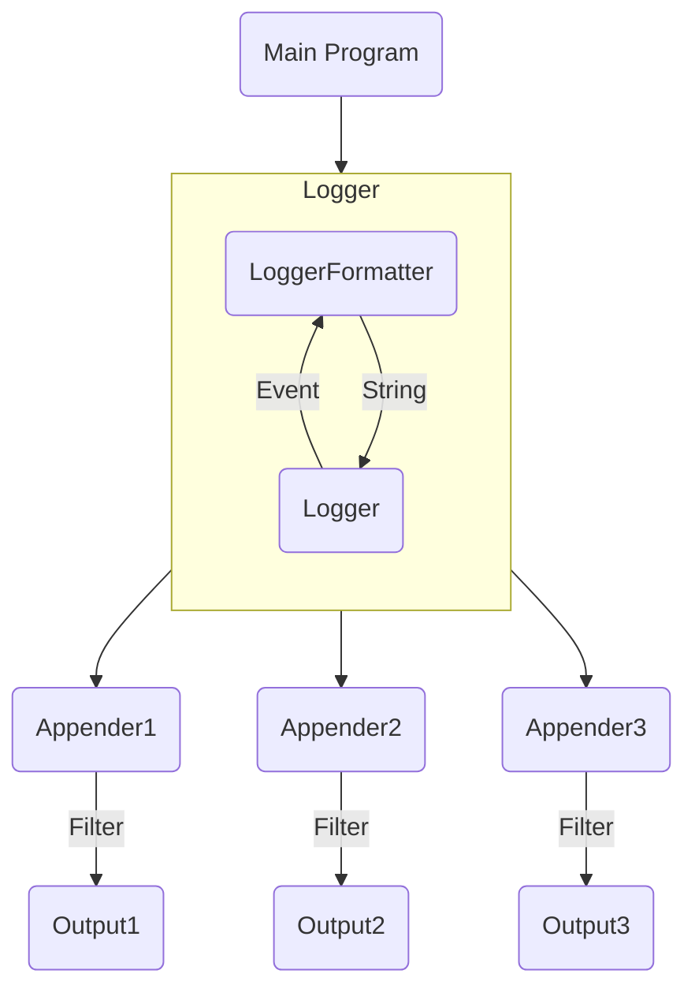

# LogSystem

Log System contains several subsystems:
+ Logger
+ Logger Appender
+ Logger Formatter

In conclusion, the program uses the log system mainly with **Logger**. After that, the **LogEvent** is delivered to **LoggerFormatter** to convert to a **string**, and then is printed out through the **LoggerAppender**.

The basic workflow of the system looks as follow.


## Logger
Logger is the main API providers for the user program. We provide these APIs for user to use
```csharp
// Function Forms Logging APIs
void Log(LogLevel level, string message);
// For convenient use
void Debug(string message);
void Info(string message);
void Warn(string message);
void Error(string message);
void Fatal(string message);
```
In conclusion, a typical usage of **Logger** looks like this:
```csharp
// 1. Initialize a Logger with Name and LogLevel
var mainLogger = new Logger("main", LogLevel.Info);
// 2. Bind a LogFormatter (Here we use Default Formatter)
var exampleFormatter = new Formatter();
mainLogger.BindFormatter(exampleFormatter);
// 3. Bind a Logger Appender (Here we set stdout as our output)
var exampleAppender = new StdoutAppender(LogLevel.Info);
mainLogger.AddAppender(exampleAppender);
// 4. Add Log in your program wherever you like
mainLogger.Log(LogLevel.Info, "Hello World");
```

For convinient usage, we define a "root" logger at the beginning, so you can use it as follow:

```csharp
var rootLogger = LoggerMan.GetInstance().GetRootLogger();
rootLogger.Info("Hello World");
```

It'll use default formatter and default appender (stdout appender).

## LoggerFormatter

The logger formatter should be initialized with a pattern string, otherwise, it'll use a default string pattern to initialize itself.

A typical string pattern looks like this,
```csharp
"%d{%y-%M-%d %H:%m:%s}%T%t%T%N%T%F%T[%p]%T[%c]%T%f:%l%T%m%n"
```
In fact, this string is also the default pattern of the formatter. Here is the list of all descriptions of all parts in this pattern.

| TERM   | DESCRIPTION                             | TERM | DESCRIPTION                              |
| ------ | --------------------------------------- | ---- | ---------------------------------------- |
| %m     | Log Message String                      | %p   | Log Level: *Debug/Info/Warn/Error/Fatal* |
| %r     | Elapse Time from Program Beginning (ms) | %c   | Name of the **Logger**                   |
| %t     | Thread ID                               | %F   | Fabric ID                                |
| %n     | Enter                                   | %T   | Tab                                      |
| %l     | Line Number                             | %f   | Name of the File                         |
| %d{xx} | Time, the format can be specified       | %N   | Name of the Thread                       |
| %%     | Normal %                                |      |                                          |

The format of the **Time** is described as following:

| TERM | DESCRIPTION   | TERM | DESCRIPTION |
| ---- | ------------- | ---- | ----------- |
| %y   | Year (eg. 23) | %M   | Month       |
| %d   | Day           | %H   | Hour        |
| %m   | Minute        | %s   | Second      |

If there exists a wrong format in time formatting, this time will use default time pattern to show. It's also the same if there is a problem in logging formatting.
