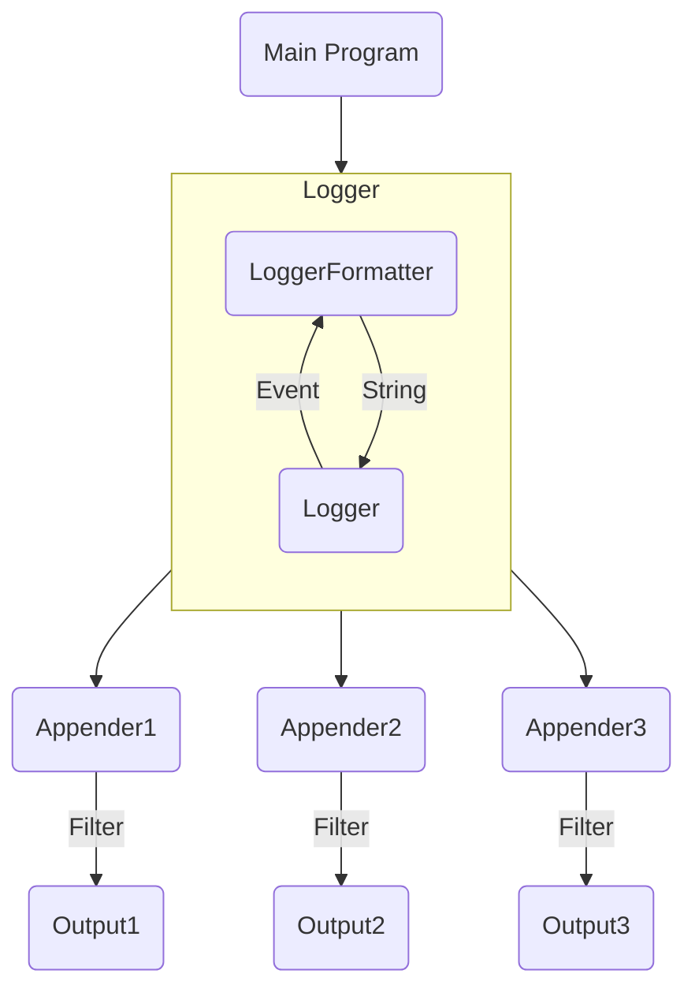

# Log System

Log System contains several subsystems:
+ Logger
+ Logger Appender
+ Logger Formatter

In conclusion, the program uses the log system mainly with **Logger**. After that, the **LogEvent** is delivered to **LoggerFormatter** to convert to a **string**, and then is printed out through the **LoggerAppender**.

The basic workflow of the system looks as follow.


## Logger
Logger is the main API providers for the user program. We provide these APIs for user to use
```csharp
// Function Forms Logging APIs
void Log(LogLevel level, string message);
// For convenient use
void Debug(string message);
void Info(string message);
void Warn(string message);
void Error(string message);
void Fatal(string message);
```
In conclusion, a typical usage of **Logger** looks like this:
```csharp
// 1. Initialize a Logger with Name and LogLevel
var mainLogger = new Logger("main", LogLevel.Info);
// 2. Bind a LogFormatter (Here we use Default Formatter)
var exampleFormatter = new Formatter();
mainLogger.BindFormatter(exampleFormatter);
// 3. Bind a Logger Appender (Here we set stdout as our output)
var exampleAppender = new StdoutAppender(LogLevel.Info);
mainLogger.AddAppender(exampleAppender);

// or you can just use this to generate a logger
// with same configurations of root logger
var mainLogger = new Logger("main", LoggerMan.GetInstance().GetRootLogger());

// 4. Add Log in your program wherever you like
mainLogger.Log(LogLevel.Info, "Hello World");
```

For convinient usage, we define a "root" logger at the beginning, so you can use it as follow:

```csharp
var rootLogger = LoggerMan.GetInstance().GetRootLogger();
rootLogger.Info("Hello World");
```

It'll use default formatter and default appender (stdout appender).

## LoggerFormatter

The logger formatter should be initialized with a pattern string, otherwise, it'll use a default string pattern to initialize itself.

A typical string pattern looks like this,
```csharp
"%d{%y-%M-%d %H:%m:%s}%T%t%T%N%T%F%T[%p]%T[%c]%T%f:%l%T%m%n"
```
In fact, this string is also the default pattern of the formatter. Here is the list of all descriptions of all parts in this pattern.

| TERM   | DESCRIPTION                             | TERM | DESCRIPTION                              |
| ------ | --------------------------------------- | ---- | ---------------------------------------- |
| %m     | Log Message String                      | %p   | Log Level: *Debug/Info/Warn/Error/Fatal* |
| %r     | Elapse Time from Program Beginning (ms) | %c   | Name of the **Logger**                   |
| %t     | Thread ID                               | %F   | Fabric ID                                |
| %n     | Enter                                   | %T   | Tab                                      |
| %l     | Line Number                             | %f   | Name of the File                         |
| %d{xx} | Time, the format can be specified       | %N   | Name of the Thread                       |
| %%     | Normal %                                |      |                                          |

The format of the **Time** is described as following:

| TERM | DESCRIPTION   | TERM | DESCRIPTION |
| ---- | ------------- | ---- | ----------- |
| %y   | Year (eg. 23) | %M   | Month       |
| %d   | Day           | %H   | Hour        |
| %m   | Minute        | %s   | Second      |

If there exists a wrong format in time formatting, this time will use default time pattern to show. It's also the same if there is a problem in logging formatting.

## Multi-Thread Support

The log system could be used in a multi-thread process with security. The `lock` keyword (or the `Monitor` class) in C# is used to keep the multi-thread security.

For example, the stdout appender may use the resource `stdout` at the same time, and the file appender may use the same file at the same time. In this way, we define a `SynchronizedIO` to replace the original `IOs` like follow:

```csharp
public class SynchronizedIO
{
    // In a multi-thread application, always use these instead of normal IOs
    public static readonly TextWriter Stdout = 
        TextWriter.Synchronized(Console.Out);
    public static readonly TextWriter Stderr = 
        TextWriter.Synchronized(Console.Error);
    public static readonly TextReader Stdin = 
        TextReader.Synchronized(Console.In);
}
```

For file operations, we use file lock of C#, like this

```csharp
[UnsupportedOSPlatform("ios")]
[UnsupportedOSPlatform("macos")]
[UnsupportedOSPlatform("tvos")]
[UnsupportedOSPlatform("freebsd")]
public static void FileWrite(string path, string content)
{
    bool lockAcquire = false;
    while (!lockAcquire)
    {
        using var fileStream = new FileStream(path, 
                                              FileMode.Append, 
                                              FileAccess.Write, 
                                              FileShare.None);
        try
        {
            fileStream.Lock(0, fileStream.Length);
            lockAcquire = true;
            using var writer = new StreamWriter(fileStream);
            writer.Write(content);
        }
        catch (IOException e)
        {
            Thread.Sleep(new Random().Next(10, 100));
        }
        finally
        {
            if (lockAcquire)
            {
                fileStream.Unlock(0, fileStream.Length);
            }
        }
    }
}
```


**Extenstion: Difference between Mutex and Lock in C#**

> *The following is an explanation of difference between `lock` and `mutex` in C# (from stack overflow)*
>
> `lock` is a compiler keyword, not an actual class or object. It's a wrapper around the functionality of the `Monitor` class and is designed to make the `Monitor` easier to work with for the common case.
>
> The `Monitor` (and the `lock` keyword) are, as Darin said, restricted to the `AppDomain`. Primarily because a reference to a memory address (in the form of an instantiated object) is required to manage the "lock" and maintain the identity of the `Monitor`
>
> The `Mutex`, on the other hand, is a .Net wrapper around an operating system construct, and can be used for system-wide synchronization, using string *data* (instead of a pointer to data) as its identifier. Two mutexes that reference two strings in two completely different memory addresses, but having the same *data*, will actually utilize the same operating-system mutex.
>
> For example, such mutex can be used in system-level synchronization
>
> ```csharp
> bool firstInstance;
> Mutex mutex = new Mutex(false, @"Local\DASHBOARD_MAIN_APPLICATION", 
>                         out firstInstance);
> 
> if (!firstInstance)
> {
>     //another copy of this application running 
> }
> else
> {
>     //run main application loop here.
> }
> // Refer to the mutex down here so garbage collection doesn't chuck it out.
> GC.KeepAlive(mutex);
> ```

