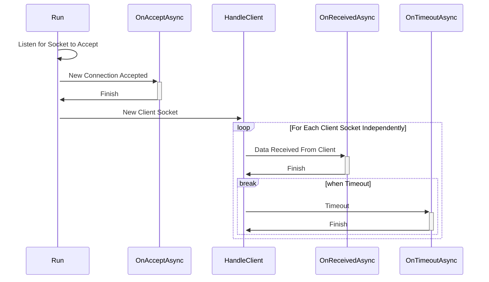

# TCP Server

该部分设计一个可继承的TCP服务器，仅需继承该类即可简单实现一个特定的TCP服务器。

## 可配置项

该系统的可配置项包括：

+ `[string] id` ：服务器ID，默认值为 “server00”

+ `[string] type`：服务器类型（http，WebSocket等），默认值为“http”

+ `[int] buf_size`：缓存区大小，默认1024

+ `[int 0/1] keepalive`：0表示关闭，1表示开启，默认值为0

+ `[int] timeout`：当keepalive为1时，timeout设置为自动发送心跳的周期（单位：s），默认值为7200（2h）

+ `[string] name`：服务器名字，默认值为 "server"

+ `[int 0/1] ssl`：0表示不启用SSL协议，1表示启用SSL协议，默认值为0

+ `[string] cert_file`：公钥文件路径（用于SSL单向认证和双向认证），默认值为null

+ `[string] key_file`：私钥文件路径（用于双向认证），默认值为null

+ `[Address] address`：服务器地址（支持IPv4和IPv6），默认值为null

  其中Address是聚合地址类，其包括三部分

  + `[string] type` 地址类型（IPv4/IPv6）
  + `[string] ip` 具体的IP地址
  + `[uint] port` 端口号

+ `[Dictionary<string, string>] args`：用于特定服务器的参数，默认值为null

## 服务器总体工作序列图



The `OnAcceptAsync`, `OnReceivedAsync` and the `OnTimeoutAsync` can be modified to satisfy your need. The signature for these methods are

```csharp
protected virtual async Task OnAcceptAsync(Socket sock, CancellationToken ct);
protected virtual async Task OnReceivedAsync(Socket client, byte[] bytes, int bytesRead,
                                             CancellationToken ct);
protected virtual async Task OnTimeoutAsync(Socket client, CancellationToken ct);
```

When `Stop()` is called, the global `CancellationToken` will be cancelled, requiring them to stop working.